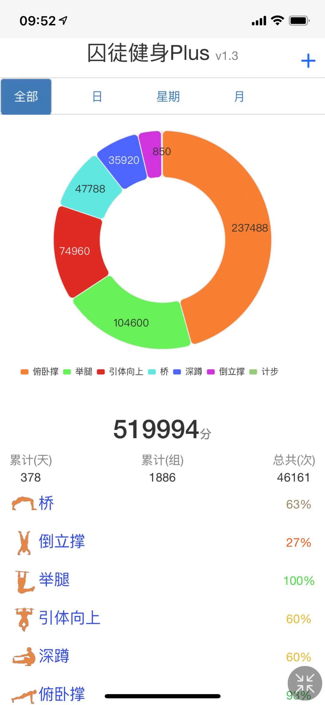
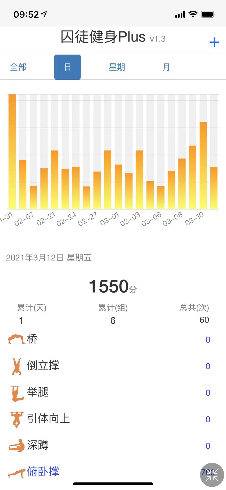
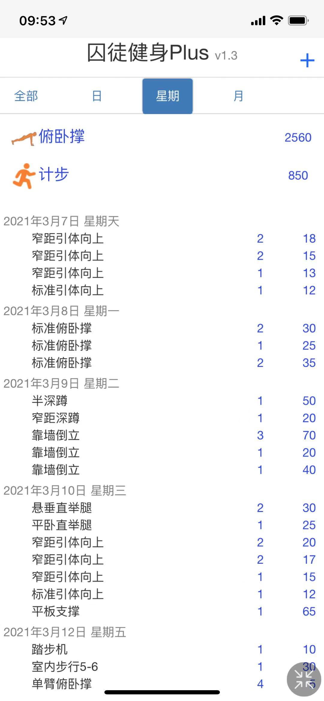
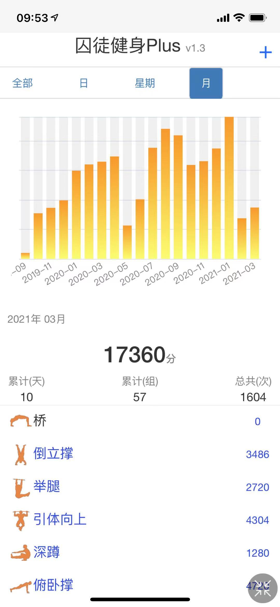

# **囚徒健身Plus（每日记录）**
##### *** ***
本人码农，2019年开始练习囚徒健身，持续记录每日训练内容。一开始使用ios一款同名app记录，后面想着自定义一些其他的训练内容，便有了这款软件，取名“囚徒健身Plus”

基于Springboot+原生js开发。因为ios app用习惯了，所以页面风格完全照搬。

因为记录，所以能坚持。自勉、共勉。

数据记录到myql中，有需要或者任何建议，可联系nodder001@163.com

### 软件截图

### 版本更新记录(部分)
1.0,2021-02-15,初始版本

1.2,2021-02-18,新增历史进度达标展示；按类别统计当前进度；按时间维度统计组数、次数功能

1.2.1,2021-02-19,新增版本记录；解决移动端访问时页面左右滑动无法固定的问题；

1.2.4,2021-02-21,编辑后父页面数据立即刷新；解决下拉框自动选中最近数据错误的问题；解决日期比较的时区问题；解决跨年时周统计的问题

1.2.5,2021-02-27,柱状图最大值展示在最顶点；进度颜色调整；

1.2.6,2021-03-01,界面TAB下拉时固定

1.3,2021-03-13,月周日类别统计区域展示各类分数；增加步数统计；切换JDK15；饼图颜色微调；

